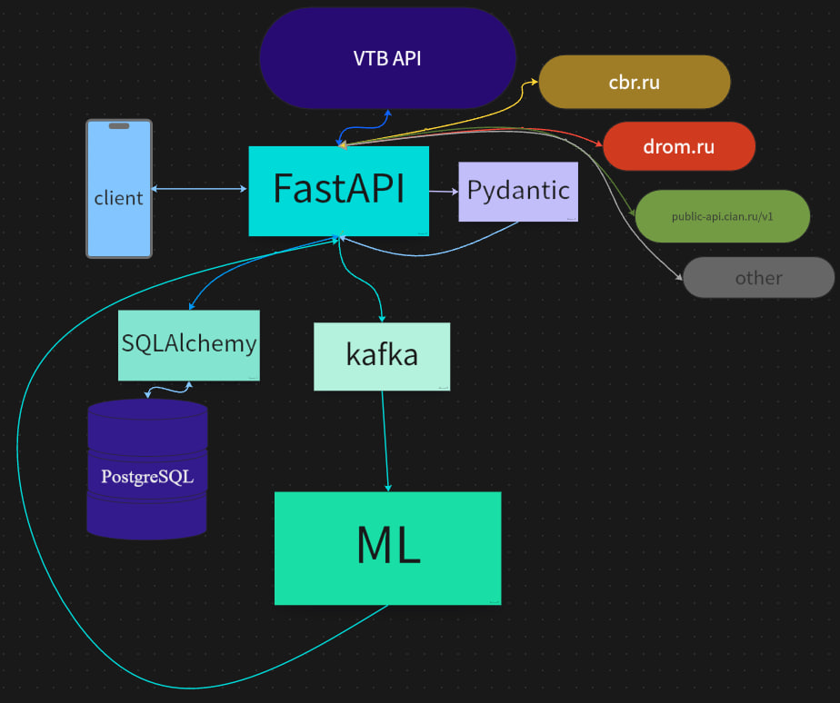

# Описание проекта

Решение позволяет пользователям создавать и управлять счетами различных типов: личными, совместными, счетами для детей, краудфандинговыми счетами, а также счетами для инвестиций и социальных целей. Пользователи могут выбирать тип счета в зависимости от своих нужд, например, личный счет для индивидуальных накоплений или совместный для коллективного накопления с другими участниками. Основной функционал включает установку накопительных целей и автоматизированный расчет необходимых сумм для конкретных товаров, таких как автомобиль или недвижимость, с учетом актуальных рыночных цен и внешних экономических факторов. Пользователь также указывает желаемый срок для достижения цели в месяцах, и система ежемесячно предоставляет персонализированные рекомендации, чтобы помочь ему достичь цели в заданные сроки.

Система анализирует финансовые возможности пользователя, учитывая его доходы, инфляцию и текущую экономическую обстановку. На основе этих данных и алгоритмов машинного обучения, таких как XGBoost и RandomForest, она предлагает оптимальные суммы для регулярного накопления, корректируя рекомендации с учетом изменения финансовых условий и прогноза инфляции. Это помогает пользователю уверенно двигаться к своей цели, обеспечивая гибкость и актуальность расчетов в любой экономической ситуации.

# Архитектура системы

## Клиент (client)
Взаимодействие начинается с клиента (мобильного приложения), который инициирует запросы для работы с аккаунтом, авторизацией, целями накопления и т.д.

## FastAPI
Основной серверный фреймворк (точка входа), обрабатывающий запросы от клиента через HTTP.  
- Реализованы эндпоинты для всех операций: создание пользователей, активация аккаунтов, авторизация, управление счетами, целями, анкетами и др.  
- Включены эндпоинты рекомендательной системы, которые прогнозируют вклады пользователей за текущий месяц, анализируя анкетные данные.  
- Также реализована интеграция с внешними API для получения данных из ЦБ РФ (валютные курсы, инфляция, ключевая ставка) и других источников.

## База данных PostgreSQL
- Хранение данных о пользователях, счетах, целях накопления, анкетных данных, а также исторической информации о расходах и доходах.  
- Сохраняет экономическую информацию, полученную из внешних API (например, данные Центрального Банка о валютных курсах, инфляции и ключевой ставке).  
- Используется SQLAlchemy для управления базой данных и взаимодействия с FastAPI.

## Kafka
- Обрабатывает анкетные данные через систему очередей, формирует схемы данных и передаёт их в модели машинного обучения.  
- Создана цельная фабрика Kafka, где консюмеры и продюсеры работают через объектный подход для повышения надежности.  
- Ускоряет обработку потоковых данных и обеспечивает надежную передачу информации в ML-модели.

## Модели машинного обучения (ML)
- Используются алгоритмы XGBoost и RandomForest.  
- Основные задачи: прогноз вкладов пользователей, расчет оптимальных стратегий накопления и анализ финансовых данных.  
- Все модели собраны в единую директорию, что упрощает управление и обновления. Поддерживается гибкая обработка данных благодаря обновлённой архитектуре DataFrame.

## Pydantic
Обеспечивает строгую валидацию данных, поступающих в систему, и проверяет корректность запросов от клиента.

## Интеграция с внешними API
- **VTB API:** Аутентификация и авторизация через ВТБ ID.  
- **ЦБ РФ (cbr.ru):** Получение данных о валютных курсах, инфляции и ключевой ставке.  
- **drom.ru, public-api.cian.ru/v1 и другие:** Данные для расчёта стоимости целей (автомобили, недвижимость).


## Мобильное приложение
Мобильное приложение было написано под систему Android. С его помощью пользователь может создавать новые счета, определяя цель накопления, сумму, а также срок, в который сумма должна быть накоплена. Кроме того, пользователь может просматривать свои счета, получая доступ к умным рекомендациям по количеству средств, которые нужно положить на счет в текущем месяце.
Используемые технологии:
* Kotlin
* Coroutines
* Model-View-ViewModel(MVVM)
* LiveData
* View Binding
* Retrofit
* Android Jetpack Components

## ML
### Описание системы прогнозирования и рекомендаций

Система предоставляет прогнозы и рекомендации для пользователей на основе данных о 12 000 клиентов и финансовых показателей за последние 10 лет. Основные функции системы включают:

- **Рекомендации по вкладам**: система анализирует потребности пользователей в накоплении и предлагает оптимальные суммы для вкладов.
- **Прогноз инфляции**: помогает пользователю выбрать наиболее подходящую валюту или актив для сбережений, учитывая прогнозы инфляции.

#### Ключевые параметры анализа

Система машинного обучения анализирует следующие данные:

- Исторические доходы и расходы
- Финансовые цели и степень их достижения
- Потребности в накоплениях
- Прогнозируемые значения инфляции

#### Обучение модели

Система обучена на пользовательских данных (доходы, расходы, семейное положение, количество детей, образование, должность) и информации с сайта Центробанка (исторические данные инфляции, курсы валют, цены на нефть). Основные модели:

- **XGBoost**: обучена для выдачи рекомендаций по вложению средств на следующий месяц. На текущий момент точность модели составляет 60%, но ожидается её улучшение с ростом данных о реальных пользователях и расширением признаков.
- **RandomForestRegressor**: обучена для предсказания уровня инфляции на основе исторических данных с 2014 года.

## API

API представляет собой функционал для управления пользователями, их счетами, финансовыми целями и анкетными данными. Реализованы следующие функции:

- **Авторизация пользователей и управление учетными записями**: Поддержка регистрации, аутентификации и активации учетной записи для обеспечения безопасности данных пользователя.

- **Управление счетами**: Функции для создания, пополнения и снятия средств со счетов. Пользователь может выбрать тип счета: **личный**, **совместный**, **счет для детей**, **краудфандинговый**, **инвестиционный** или **социальный**. Также имеется возможность пригласить другого пользователя для совместного использования счета.

- **Управление финансовыми целями**: Создание и отслеживание целей накопления, например, на покупку автомобиля или недвижимости. Пользователь может указать сумму цели вручную или выбрать цель, для которой система рассчитает необходимую сумму на основе среднерыночной стоимости выбранного объекта (например, автомобиля из списка).

- **Работа с персональными анкетами**: Сбор данных об уровне доходов, расходах и других финансовых показателях пользователя для более точного прогнозирования и рекомендаций.

- **Прогнозирование и расчет рекомендуемых вкладов**: Машинное обучение используется для анализа исторических данных, доходов и расходов, а также поставленных целей, чтобы рекомендовать оптимальные суммы вкладов и наилучшую стратегию накопления.

- **Прогнозирование инфляции и выбор валюты для накоплений**: Интеграция с данными Центрального Банка России позволяет прогнозировать инфляцию, анализировать ключевые экономические показатели и подсказывать пользователям, в какой валюте наиболее выгодно вести накопления.

- **Доступ к данным Центрального Банка России и работа с банковскими картами**: Получение актуальных данных по инфляции, валютным курсам, ключевой ставке, а также возможность отслеживания баланса по банковским картам.

## API Маршруты и Примеры запросов

### 1. Управление счетами

- **GET /accumulated_accounts/** - Получение списка счетов пользователя.
    ```bash
    curl -X 'GET' \
      'http://host/accumulated_accounts/' \
      -H 'accept: application/json' \
      -H 'Authorization: <your_token>'
    ```

- **POST /accumulated_accounts/** - Создание нового счета. Пользователь может выбрать тип счета: **личный**, **совместный**, **счет для детей**, **краудфандинговый**, **инвестиционный** или **социальный**.
    ```bash
    curl -X 'POST' \
      'http://host/accumulated_accounts/' \
      -H 'accept: application/json' \
      -H 'Authorization: <your_token>' \
      -H 'Content-Type: application/json' \
      -d '{
            "amount": 10000.0,
            "currency": "RUB",
            "account_type": "совместный"
          }'
    ```

- **POST /accumulated_accounts/invite** - Приглашение другого пользователя в счет.

- **POST /accumulated_accounts/deposit** - Пополнение счета.

- **POST /accumulated_accounts/withdraw** - Снятие средств со счета.


### 2. Управление картами

- **GET /card/** - Получение баланса карты пользователя.

### 3. Управление данными об автомобилях как цели накопления

- **GET /car/** - Получение списка автомобилей с фильтрацией по параметрам (модель, год выпуска, тип КПП).

### 4. Данные Центрального Банка России (ЦБР)

- **GET /inflation/** - Получение данных по инфляции на указанную дату.
    ```bash
    curl -X 'GET' \
      'http://host/inflation/?rate_date=2023-01-01' \
      -H 'accept: application/json'
    ```

- **GET /cbr/** - Получение комплексных данных по ЦБР (инфляция, ключевая ставка, валютные курсы и т.д.).

### 5. Данные по валютам

- **GET /currency/** - Получение данных по валютам на указанную дату.
    ```bash
    curl -X 'GET' \
      'http://host/currency/?rate_date=2023-01-01&currency_type=USD' \
      -H 'accept: application/json'
    ```

### 6. Управление целями накопления

- **GET /goal** - Получение информации по поставленной цели накопления.

- **POST /goal** - Указание новой цели накопления с возможностью указать сумму вручную или получить расчетную стоимость на основе выбора цели (например, автомобиль с указанием модели и автоматическим расчетом средней стоимости).

### 7. Управление пользователями

- **GET /auth/** - Авторизация пользователя.

- **POST /auth/** - Аутентификация пользователя.

- **POST /user/** - Создание нового пользователя.

- **POST /activate_user/** - Подтверждение пользователя по СМС-коду.

- **GET /user_vtb/** - Вход через ВТБ ID. Позволяет пользователю авторизоваться, используя привязанный ВТБ ID.

### 8. Анкета пользователя

- **GET /user_profile/** - Получение анкеты пользователя.

- **POST /user_profile/** - Заполнение анкеты пользователя.
